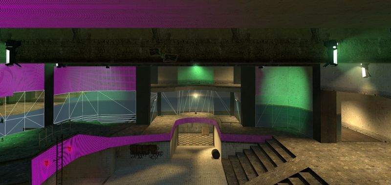

# BSP Extractor

The Community's BSP files are missing textures, models, and sounds due to the case sensitivity of Linux and a [issue](https://github.com/ValveSoftware/Source-1-Games/issues/6868) after recent updates to Source.

There are no changes to any map or game files, and it is completely safe to use on secure servers (without the risk of VAC ban).



## Installation

### Install VPKEdit
Please read [this](https://github.com/craftablescience/VPKEdit/blob/main/INSTALL.md#linux) file for step-by-step installation instructions.

### Clone the repository
```shell
git clone https://github.com/yourusername/bsp-extractor.git
cd bsp-extractor
```

### Install dependencies
```shell
pip install pyinotify
```

## Usage
Pass a download directory, an example the default for the Steam's HL2DM
```shell
bsp-extractor.py "$HOME/.local/share/Steam/steamapps/common/Half-Life 2 Deathmatch/hl2mp/download"
```

You might need to reconnect to server if you see `Missing map material` error. 
Though the map are extracted immediately you've connected faster than it's done.     

## How It Works

* File Discovery: The tool scans the source directory for BSP files or monitors it for new files
* History Checking: Already processed files are skipped based on the history file
* Extraction: BSP files are extracted using `vpkeditcli`
* Asset Synchronization: All directories from the extracted content are moved to the destination
* History Update: Successfully processed files are added to the history file

```
2025-03-10 20:36:06,453 - Scanning for BSP files in: /home/user/.local/share/Steam/steamapps/common/Half-Life 2 Deathmatch/hl2mp/download/maps
2025-03-10 20:36:06,453 - Found 1 BSP files
2025-03-10 20:36:06,453 - Already processed file: dm_snipe_eye2.bsp
2025-03-10 20:36:06,453 - No new BSP files to process.
2025-03-10 20:36:06,457 - Watching directory: /home/user/.local/share/Steam/steamapps/common/Half-Life 2 Deathmatch/hl2mp/download/maps
2025-03-10 20:36:06,457 - Press Ctrl+C to stop
2025-03-10 20:36:20,333 - New BSP file detected: 2011_killbox_modx_hd.bsp
2025-03-10 20:36:20,333 - Processing Maps 1/1 100% 2011_killbox_modx_hd
2025-03-10 20:36:20,641 - Updated history file with 1 newly processed BSP files.
2025-03-10 20:39:41,495 - New BSP file detected: dm_[jkal]_dead_end_b5.bsp
2025-03-10 20:39:41,495 - Processing Maps 1/1 100% dm_[jkal]_dead_end_b5
2025-03-10 20:39:41,856 - Updated history file with 1 newly processed BSP files.
2025-03-10 20:40:19,050 - New BSP file detected: 2011.bsp
2025-03-10 20:40:19,050 - Processing Maps 1/1 100% 2011
2025-03-10 20:40:19,303 - Updated history file with 1 newly processed BSP files.
```
## Requirements
* Python 3.6+
* Linux with inotify support
* `vpkeditcli` tool for BSP extraction

## Acknowledgments

- This tool was inspired by [scorpius2k1/linux-bsp-casefolding-workaround](https://github.com/scorpius2k1/linux-bsp-casefolding-workaround) shell script
- Thanks to the developers of [VPKEdit](https://github.com/craftablescience/VPKEdit) for solving the problem during an extraction
